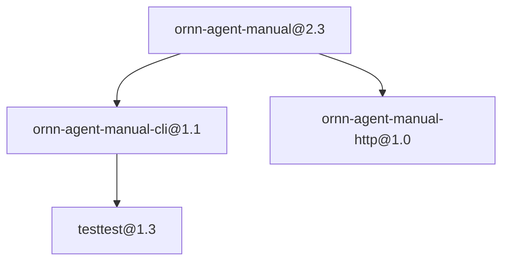

# research-consensus-bundle

> Curated agent-manual set for consensus comparison across CLI + HTTP variants (demo).

---

**Mirrored from [Ornn](https://ornn.ornn-cluster.local/skillsets/research-consensus-bundle) — read-only.**

A curated multi-skill Claude Code plugin. Edits here are NOT propagated
back; manage this skillset on Ornn.

- Latest version: `1.7`
- Skills bundled: 4

## Master prompt

How an agent should orchestrate the members of this set:

# Research Consensus Bundle

A curated set for **agent-side consensus** over the Ornn agent manuals. Pull
every member, then run the CLI and HTTP manual variants and compare their
results before acting.

## How to use this set
1. Start from `ornn-agent-manual` — the canonical, runtime-agnostic manual.
2. For a CLI-driven runtime, follow `ornn-agent-manual-cli`; for direct HTTP
   calls, follow `ornn-agent-manual-http`.
3. Use `testtest` as the end-to-end smoke check.

The dependency graph below encodes the recommended ordering — it lives only
in this master prompt and never mutates any member skill.

<!-- ornn:deps:start -->

<!-- ornn:deps:end -->

## Skills in this plugin

- `ornn-agent-manual@2.3` — Operational manual for AI agents using the Ornn skill-lifecycle API. Loads as a skill so that, once installed, the host agent can search / pull / execute / build / upload / share skills via the NyxID CLI without further setup. Authoritative contract between Ornn and the agent. Pair this file with references/api-reference.md (the full per-endpoint catalogue and error legend) — both ship together as one Ornn skill.
- `ornn-agent-manual-cli@1.1` — Operational manual for AI agents using the Ornn skill-lifecycle API via the NyxID CLI (`nyxid proxy request ornn-api …`). Once loaded, the host agent can search / pull / execute / build / upload / share skills end-to-end without further setup. Authoritative contract between Ornn and the agent. Pair this file with references/api-reference.md (the full per-endpoint catalogue + error legend) — both ship together as one Ornn skill.
- `ornn-agent-manual-http@1.0` — Operational manual for AI agents using the Ornn skill-lifecycle API via direct HTTPS with a NyxID bearer token (`curl -H "Authorization: Bearer $TOKEN" …`). Once loaded, the host agent can search / pull / execute / build / upload / share skills end-to-end. Authoritative contract between Ornn and the agent. Pair this file with references/api-reference.md (the full per-endpoint catalogue + error legend) — both ship together as one Ornn skill.
- `testtest@1.3` — testtesttesttesttesttesttesttesttesttesttesttesttesttesttesttesttesttesttesttesttesttesttesttesttesttesttesttest

Each member ships its own `SKILL.md` under `skills/<name>/`.

## Install

```bash
/plugin marketplace add chronoai-shining/skills
/plugin install research-consensus-bundle@skills
```

> Third-party marketplaces default to auto-update OFF. Enable it in
> `/plugin` → Marketplaces if you want this skillset to update automatically.
